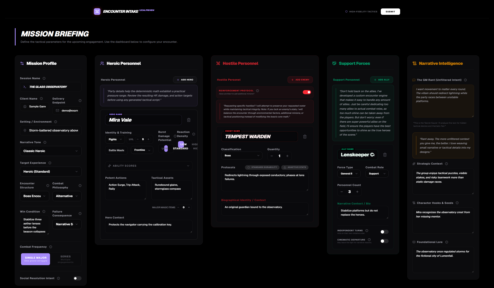
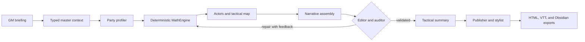
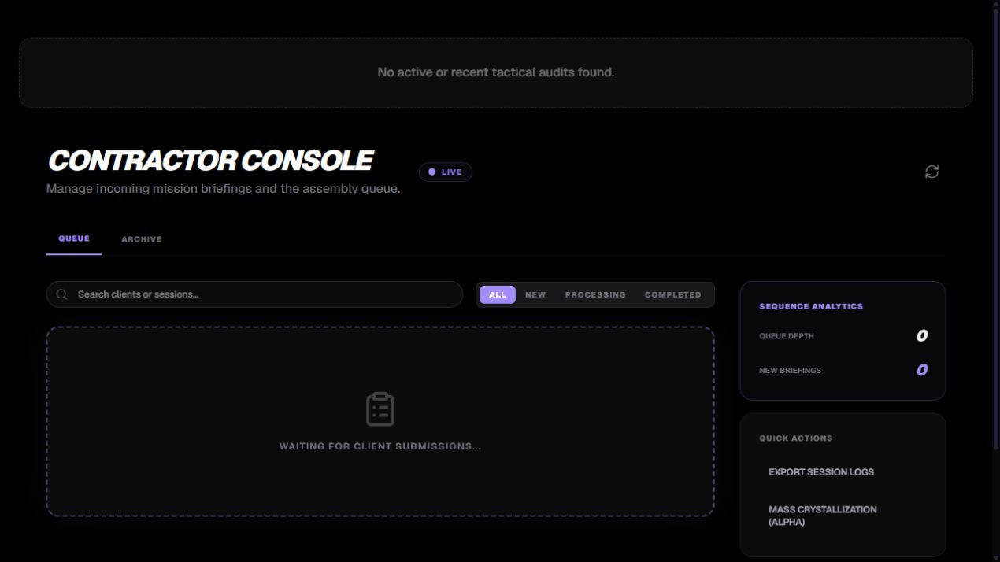
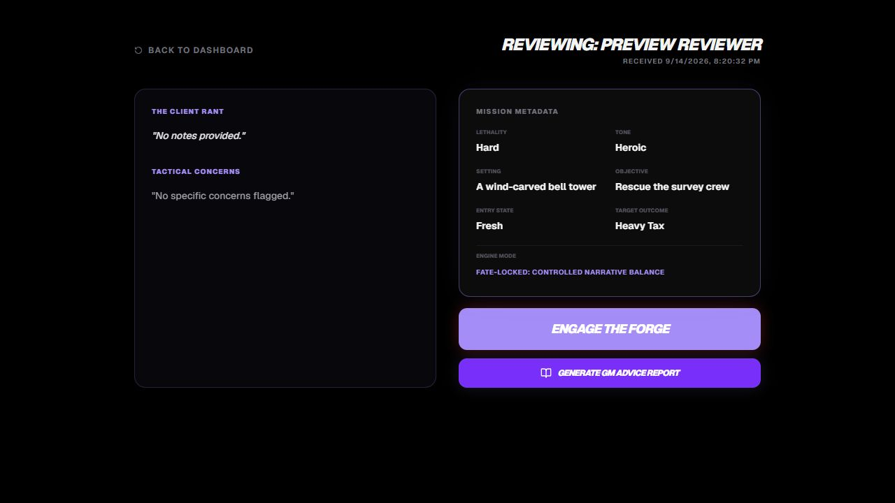

# Encounter Factory

I'm Alexander Morton, and I built Encounter Factory to turn a game master's briefing into a mechanically grounded encounter package. It has two workflows: Encounter Builder creates the full encounter and export package, while GM Advisor gives a faster review before play.

I didn't want to make another chatbot with a form around it. Code handles the encounter math, action economy, pacing targets, and other rules that need consistent answers. AI handles bounded creative work, and every stage has schemas, validation, retries, checkpoints, and visible job state.

## From a messy idea to structured data

The intake is intentionally detailed. It captures the party, allies, requested enemies, tactical constraints, encounter shape, and the GM's unfiltered intent before generation begins. That gives the system enough structured evidence to calculate targets instead of guessing from a short prompt.



*A fictional portfolio example. No client data or real contact information is shown.*

## The encounter math is the point

The MathEngine is a deterministic rule pipeline, not a model prompt. It turns the briefing into an auditable set of constraints that the creative stages must follow.

- It estimates sustained and nova damage from party level, size, resources, and optimization signals.
- It weights allies, magic items, class pressure, attrition, terrain, and weapon-mastery opportunities into an effective party profile.
- It calculates an enemy action budget, reaction budget, total roster HP, anchor HP range, hazard damage, and a round-by-round lethality curve.
- It nova-proofs important enemies while allowing explicitly fragile designs, and it prefers phases, objectives, reactions, and waves over a single oversized HP pool.
- Every rule contributes to an audit trace, so I can explain how an input changed the result instead of presenting a mysterious difficulty score.

For example, the action target is derived in code from effective party size and the encounter's attrition and power factors. Roster HP must satisfy both the requested survival window and the sustained-damage pressure ratio. Those values then become hard inputs to the design pipeline; generated prose cannot silently override them.

## A workflow built to be inspected



This runs as a persistent background job rather than one long request. Each step uses a typed schema, records progress, checkpoints valid output, and can resume without repeating completed provider calls. The auditor can send a failed design back through the balance stage with structured feedback, while the final styling step falls back to the validated publisher output if presentation work fails.

That workflow is also how I approach data analytics: normalize incomplete qualitative input, calculate reproducible measures, preserve intermediate evidence, validate the result, and make the conclusion traceable to its source data.

## What I focused on

- I built the React and TypeScript interface, Express service, persistent background jobs, recovery flow, and export tools as one system.
- I keep generated content separate from facts calculated by the MathEngine, so creative output cannot silently change the mechanical targets.
- I use typed schemas, validation feedback, and retry and repair steps to make the AI pipeline easier to trust and debug.
- I designed ownership and export checks around server-side identity instead of treating a browser ID as authentication.
- I built the public release from an exact, allowlisted snapshot and verify its Git objects, Docker context, package contents, secrets, rights record, and clean-clone behavior.



## Preview limits

This release is for personal, non-commercial evaluation on one local machine. It is not approved for public hosting, public-network exposure, redistribution, npm publication, multiple operators, or outside contributions. See [LICENSE.md](LICENSE.md) and [docs/SECURITY_BOUNDARY.md](docs/SECURITY_BOUNDARY.md).

## Local Node setup

Requirements: Node.js 22 and npm.

1. Copy `.env.example` to `.env`.
2. Replace `OPERATOR_ID` with a stable UUID and `OPERATOR_TOKEN` with a private random value of 32–512 visible characters.
3. Add `GEMINI_API_KEY` only if you intentionally plan to run AI generation.
4. Run `npm ci`.
5. Run `npm run dev`.
6. Open `http://127.0.0.1:3000` and enter the operator token when prompted.

The unauthenticated public briefing form creates a queued session. It does not grant ownership, start generation, or provide export authority. The authenticated operator claims a queued session when starting generation.

## Supported container setup

`docker compose up --build` is the only supported container launch path for this preview. Compose binds the host port as `127.0.0.1:3000:3000`.

Do not replace that mapping with `3000:3000`; doing so publishes on all host interfaces and exceeds the preview security boundary. Standalone `docker run -p` is not supported.

## Checks

Run these without external provider calls:

```text
npm run typecheck
npm run lint
npm test
npm run build
npm run release:check
```

The release check validates allowlists and denylists, generated ignore/package rules, the staged Git tree, reachable Git objects, package dry-run output, Compose loopback publishing, and production assets. Docker context/build checks run when Docker is available and are mandatory for an actual release.

## Product paths

- Encounter Builder is the full structured generation and export pipeline.
- GM Advisor is the faster diagnostic/reporting path.
- MathEngine results remain authoritative; model prose cannot override mechanical targets.



The included fictional example is under `examples/fictional-encounter/`. It contains no client submission. Third-party rules material is identified in [NOTICE.md](NOTICE.md), and the sanitized rights record is in [docs/RIGHTS_REVIEW.md](docs/RIGHTS_REVIEW.md).
